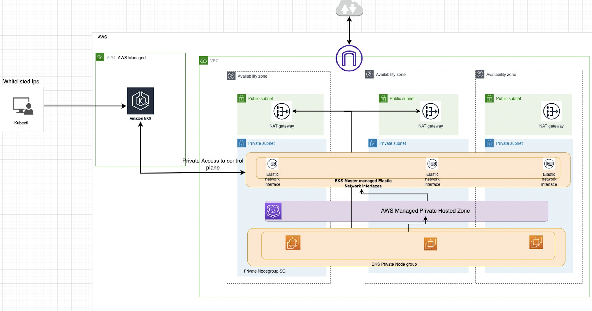

# eks_with_terraform
In this we are deploying the python application in EKS cluster. Required infra is created by Terraform templates and CICD pipelines

# Tools used
1. AWS
2. Terraform
3. ArgoCD
4. AzureDevOps
5. Trivy 
6. Helm

# How to use
1. 01_prerequsite_infra- contains the prerequisite infra required for this setup to work, this contain 
    1. 01_terraform_statemgmt- Terraform will lock your state for all operations that could write state. This prevents others from acquiring the lock and potentially corrupting your state.

    2. 02_ecr- This terraform template is used to create ECR for managing container images

2. 02_eks_cluster- All the required files for EKS cluster creation placed under this directory structure, ADO CI pipeline is also added.

Architecture diagram-

3. 03_eks_adons- All the required resources for adding aws load balancer controller placed in eks_adons

4. 04_argocd_deployment- Contains the shell script to deploy the ArgoCD for kubernetes application deployment

5. 05_pyapp- This contains a sample python application code, with its CI pipeline which will be build the image, scan and publish it to ECR repo

6. 06_pyapp-k8manifest- Used by ArgoCD to deploy the k8 manifests file to eks cluster.
